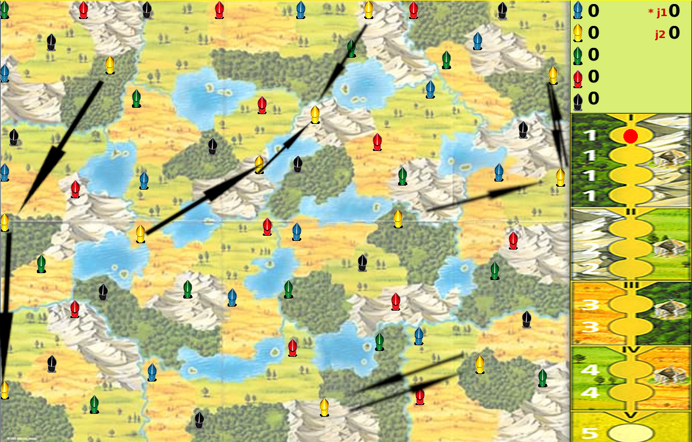
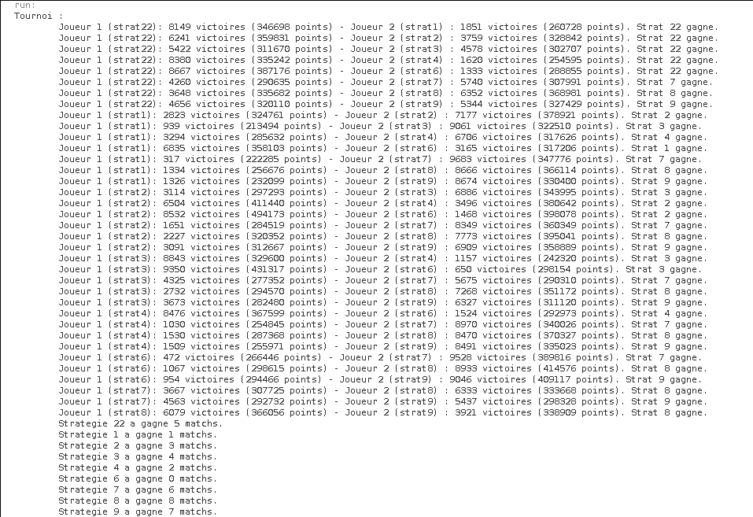
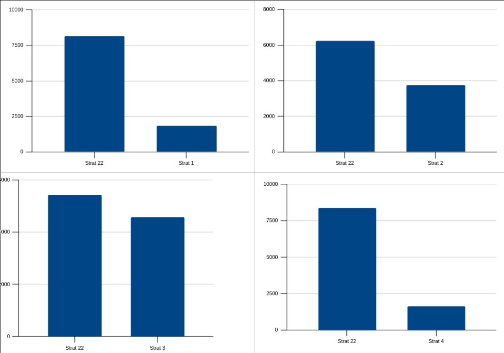
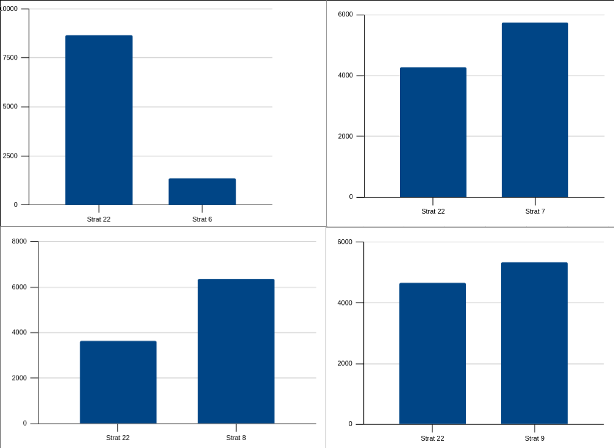

# Clans 

## Principe de ma stratégie

## Mouvement :

La stratégie de mouvement est divisée en trois cas :

- Il n'y a pas formation de villages possible et il y a plus de 45 territoires sources disponibles 

- Il n'y a pas formation de vilages possible et il y a moins de 45 territoires sources disponibles

- Il y a possibilté de former un village


### 1 - Il n'y a pas formation de villages possible et il y a plus de 45 territoires sources disponibles 

Ici on se base sur le principe que plus les hutes de même couleur sont espacées plus il y a de chances que celle-ci sont dans un village plus tard dans la partie.

Pour quantifier la notion d'espacement on calcule la somme des distances minimales entre une hute de couleur i et le territoire ayant une hute de couleur i le plus proche.

Prenons l'exemple de la couleur jaune.

Cela revient à calculer la somme des flèches dans l'image ci-dessous:




Donc le calcul de cette distance ne dépend pas du territoire sur lequel nous débutons la recherche.

Avec cette somme de distance on calcule un score qui représente la différence entre la variation de l'espacement des couleurs de l'IA et de la variation de l'espacement des autres couleurs.


`output = ((myColorDistAfter - myColorDistBefore) * 5) - (sommeDistCouleurPrensenteAfter - sommeDistCouleurPrensenteBefore);
`

On prend ensuite la combinaison source destination qui rapporte le plus grand score.

### 2 - Il n'y a pas formation de vilages possible et il y a moins de 45 territoires sources

On passe dans ce cas à une autre stratégie car avec la diminution du nombre de territoires sources possibles la pertinence du calcul de l'espacement pour évaluer un mouvement devient moindre.

Dans ce cas on cherche à savoir si le mouvement qu'on s'apprete à jouer va donner une opportunité au joueur adverse de former un village durant son tour.

Pour cela on utilise la fonction ci-dessous :

```java
    public boolean formationVillageProchainCoup(int idSrc) {
        boolean output = false;
        int nbVoisins = this.plateau[idSrc].getNbVoisins();

        for (int i = 0; i < nbVoisins; ++i) {
            if (Tools.getNbVoisinsNonVide(this.plateau, this.plateau[idSrc].getVoisin(i)) < 3)
                output = true;
        }

        return output;
    }

```

Cette foncion retourne pour une source donnée si vrai ou faux un village peut être former au prochain coup.

Si se n'est pas le cas on sauvegarde cette source et on prend une destination au hasard dans la liste de voisins de cette source.

### 3 - Il y a possibilté de former un village

Si il y a une ou plusieurs possibilités de former un ou plusieurs villages on calcule pour chaque possibilté un score représentant la différence des gains obtenues par l'IA et sa couleur, moins le gain de la couleur ayant le gain le plus important parmis les autres couleurs. 

On choisit la combinaison source/destination avec le score le plus élevé.


## Choix de l'ordre :

Dans le cas où au moins deux villages sont formés avec un mouvement, on génère l'ensemble des combinaisons possibles et on calcule, de la même manière que le troisième cas de la stratégie de mouvement, le score que rapporterait chaque ordre de création.

On choisit au final l'ordre/combinaison qui rapporte le score le plus grand.


## Résulat :

### Résultat brutte :




### Ma Stratégie (strat 22) face aux autres : 






### Classement

1. Strat 8 : 8 matchs gagnés
2. Strat 9 : 7 matchs gagnés
3. Strat 7 : 6 matchs gagnés
4. Strat 22 : 5 matchs gagnés
5. Strat 3 : 4 matchs gagnés
6. Strat 2 : 3 matchs gagnés
7. Strat 4 : 2 matchs gagnés
8. Strat 1 : 1 matchs gagné
9. Strat 6 : 0 matchs gagné